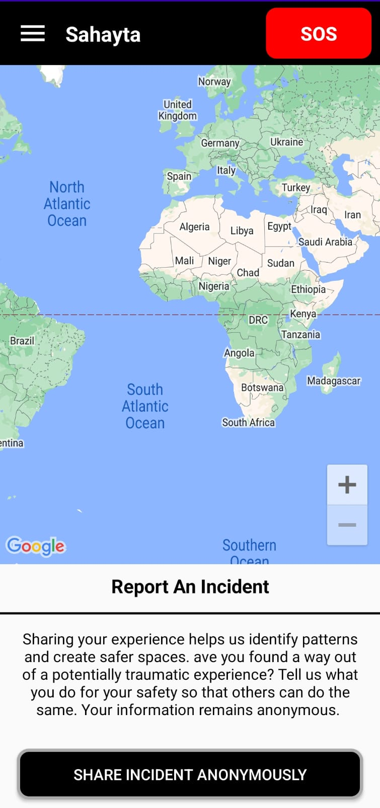
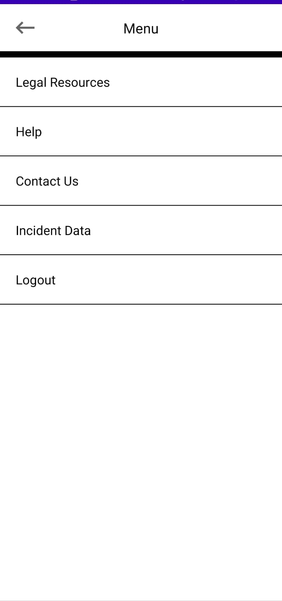
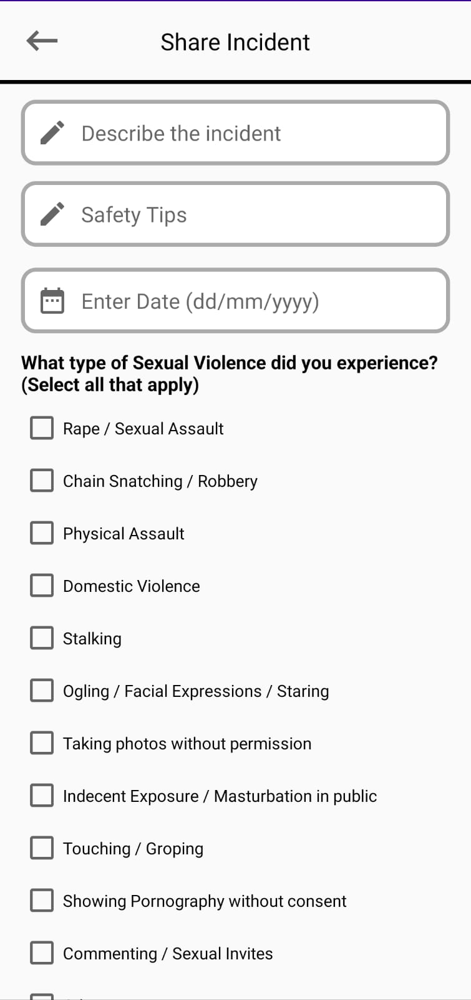
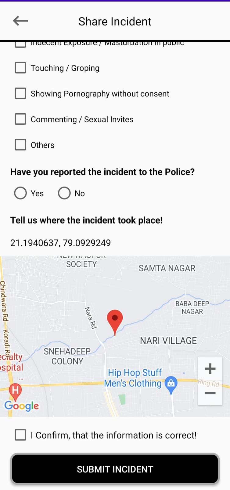
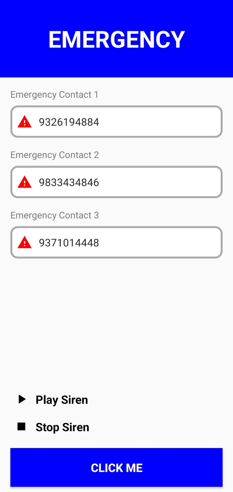

# SheBuilds-sahayta

Sahayta is a women safety app which sends your location to your emergency contacts in the need of help

# Look and feel

       

# Functionalities

Sahayta works in ways to help women tackle uncomfortable incidents faced by them during any time of the day:
1)The user can click the sos button to send its location to the emergency contacts registered 
2)The app comes in handy to play the siren to scare away the potential incident 
3)Anyone can report an incident anonymously which marks that area on the map as red zone to alert the other users 
4)It also provides the user with useful legal resources like emergency numbers
